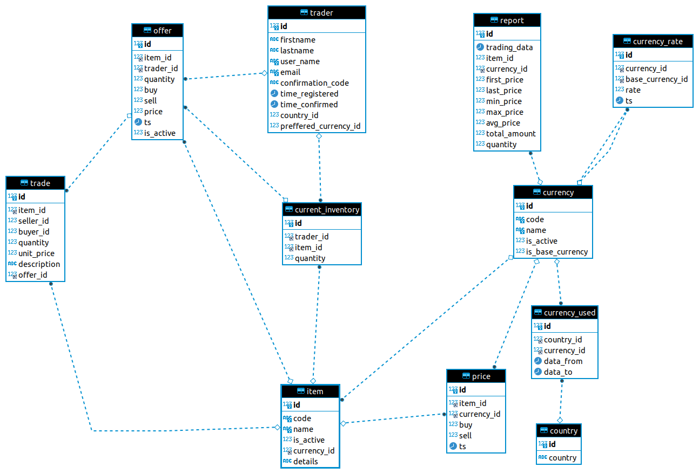

Согласно представленному заданию мне было необходимо придумать тему и по ней создать базу данных.Вот общее описание проекта:

**Требования к курсовому проекту:**
1. Составить общее текстовое описание БД и решаемых ею задач;
2. минимальное количество таблиц - 10;
3. скрипты создания структуры БД (с первичными ключами, индексами, внешними ключами);
4. создать ERDiagram для БД;
5. скрипты наполнения БД данными;
6. скрипты характерных выборок (включающие группировки, JOIN'ы, вложенные таблицы);
7. представления (минимум 2);
8. хранимые процедуры / триггеры;

*Примеры: описать модель хранения данных популярного веб-сайта: кинопоиск, booking.com, wikipedia, интернет-магазин, geekbrains, госуслуги...*

За основу я взял [статью](https://vertabelo.com/blog/a-data-model-for-trading-stocks-funds-and-cryptocurrencies/), размещенную на иностранном источнике. В ней показана основная схема. Осталось только ее перевести в SQL. Прежде перевод теории.

Торговля криптовалютами, покупка акций и тому подобное в наши дни чрезвычайно популярны, так как это воспринимается как легкая прибыль. В настоящее время цены растут, но мы не можем знать, когда это изменится. С другой стороны, мы знаем, что в какой-то момент это произойдет. Но мы здесь не для того, чтобы делать финансовые прогнозы. Вместо этого мы поговорим о модели данных, которую можно использовать для поддержки торговли криптовалютами и финансовыми инструментами, такими как акции или акции фондов.

### 1. Общее текстовое описание базы данных и решаемых задач

**Что Вам нужно знать О Торговле Валютами и Акциями**

Технологические усовершенствования за последние несколько десятилетий оказали значительное влияние на торговлю. В настоящее время существует множество онлайн-торговых платформ, которые вы можете использовать. Большая часть сегодняшней торговли осуществляется виртуально – вы можете увидеть бумажные акции в музеях, но вряд ли вы увидите акции, которые вы покупаете в бумажной форме. И вам не нужно паковать чемоданы и отправляться на Уолл-стрит или любую другую фондовую биржу, чтобы совершить сделку. Не выходя из своего компьютера или мобильного устройства, вы можете покупать или продавать производные финансовые инструменты (такие как облигации, акции или товары).

Большинство сделок (продажа производных финансовых инструментов) следуют тем же правилам. Есть продавцы и покупатели. Если они договорятся о цене, сделка состоится. После сделки цена этого производного финансового инструмента будет пересчитана, и процесс продолжится с новыми трейдерами. Акции и другие производные финансовые инструменты работают точно так же.

Что такое криптовалюта? Вы, наверное, слышали о биткойне и других криптовалютах. Но что это такое? Криптовалюты похожи на виртуальные валюты, но они не привязаны к валютам реального мира (таким как евро или доллары). Вместо этого пользователи могут торговать криптовалютами между собой, как токенами. Затем они могут договориться о продаже, которая превратит их токены в реальные деньги. Эти продажи функционируют точно так же, как описанные выше сделки с акциями и акциями.

Эта тема сложна, и в нашей модели может быть много деталей (например, записи документов и транзакций). Я собираюсь сделать это просто; я не буду реализовывать какую-либо автоматическую торговлю или какие-либо формулы для создания новых цен после торгового события.

Перейдем к коду. Согласно статье база состоит из трех блоков:

* CURRENCIES
* TRADERS
* ITEMS

Теперь напишем код ля каждого блока:

### 2. Cкрипты создания структуры БД

#### CURRENCIES

~~~~sql
CREATE DATABASE IF NOT EXISTS coursework_portfolio;
USE coursework_portfolio;
~~~~

Сначало создаю страну из которой осуществляется торговля

~~~~sql
DROP TABLE IF EXISTS country;

CREATE TABLE country(
	id SERIAL PRIMARY KEY,
	country VARCHAR(128)
) COMMENT = 'Страна из которой осуществляется торговля';
~~~~

Валюту которую использует пользователь для торговли

~~~~sql
DROP TABLE IF EXISTS currency_used;

CREATE TABLE currency_used(
	id SERIAL PRIMARY KEY,
	country_id BIGINT UNSIGNED NOT NULL COMMENT 'Ключ на другую таблицу',
	currency_id INT UNSIGNED COMMENT 'Ключ на другую таблицу',
	data_from DATETIME DEFAULT CURRENT_TIMESTAMP COMMENT 'Дата начала использования валюты',
	data_to DATETIME DEFAULT CURRENT_TIMESTAMP COMMENT 'Дата окончания использования валюты. Если NULL, то валюта до сих пор используется'
) COMMENT = 'Валюта использованная для покупки';

DESC currency_used ;
~~~~

Хранятся текущие и исторические курсы между валютными парами.

~~~~sql
DROP TABLE IF EXISTS currency_rate;

CREATE TABLE currency_rate(
	id SERIAL PRIMARY KEY,
	currency_id INT UNSIGNED COMMENT 'Ключ на другую таблицу',
	base_currency_id INT UNSIGNED COMMENT 'Ключ на другую таблицу',
	rate DECIMAL(16,6) NOT NULL DEFAULT 0 COMMENT 'Курс валюты',
	ts DATETIME DEFAULT CURRENT_TIMESTAMP COMMENT 'Время в которое данный курс был зафиксирован'
) COMMENT = 'Курс валюты';
~~~~

Хранить все валюты, которые мы когда-либо использовали для торговли.

~~~~sql
DROP TABLE IF EXISTS currency;

CREATE TABLE currency(
	id INT UNSIGNED PRIMARY KEY,
	code VARCHAR(8) NOT NULL UNIQUE COMMENT 'Код используемый для уникального обозначения валюты',
	name VARCHAR(128) NOT NULL UNIQUE COMMENT 'Уникальное название этой валюты',
	is_active BOOL DEFAULT FALSE COMMENT 'Если валюта в настоящее время активна в нашей системе',
	is_base_currency BOOL DEFAULT FALSE COMMENT 'Если эта валюта является базовой валютой нашей системы.'
) COMMENT = 'Курс валюты';
~~~~

####ITEMS

Таблицы item определяют все товары, доступные для торговли, и их текущий статус. Также здесь записываются все изменения, произошедшие с этими товарами с течением времени.

~~~~sql
DROP TABLE IF EXISTS item;

CREATE TABLE item(
	id SERIAL PRIMARY KEY,
	code VARCHAR(64) NOT NULL UNIQUE COMMENT 'Код используемый для уникального обозначения товара(акции, ПИФы и т.д.)',
	name VARCHAR(255) NOT NULL UNIQUE COMMENT 'Полное имя',
	is_active BOOL DEFAULT FALSE COMMENT 'Доступен ли этот товар для торговли или нет',
	currency_id INT UNSIGNED COMMENT 'Ссылается на валюту, используемую в качестве базовой валюты для данного товара',
	details TEXT COMMENT 'Все дополнительные сведения (например, количество выпущенных акций) в текстовом формате.'
) COMMENT = 'Доступные товары';
~~~~

Таблица цен отслеживает все изменения цен во времени.

~~~~sql
DROP TABLE IF EXISTS price;

CREATE TABLE price(
	id SERIAL PRIMARY KEY,
	item_id BIGINT UNSIGNED COMMENT 'Ссылается на валюту, используемую в качестве базовой валюты для данного товара',
	currency_id INT UNSIGNED COMMENT 'Ссылается на валюту, используемую в качестве базовой валюты для данного товара',
	buy DECIMAL(16,6) NOT NULL DEFAULT 0 COMMENT 'Курс покупки',
	sell DECIMAL(16,6) NOT NULL DEFAULT 0 COMMENT 'Курс продажи',
	ts DATETIME DEFAULT CURRENT_TIMESTAMP COMMENT 'Время в которое сделка по последней цене была зафиксирована'
) COMMENT = 'Изменение цены';
~~~~

Таблица отчета

~~~~sql
DROP TABLE IF EXISTS report;

CREATE TABLE report(
	id SERIAL PRIMARY KEY,
	trading_data DATETIME DEFAULT CURRENT_TIMESTAMP COMMENT 'Дата отчета',
	item_id BIGINT UNSIGNED COMMENT 'Ссылается на валюту, используемую в качестве базовой валюты для данного товара',
	currency_id INT UNSIGNED COMMENT 'Ссылается на валюту, используемую в качестве базовой валюты для данного товара',
	first_price DECIMAL(16,6) DEFAULT NULL COMMENT 'Начальная цена',
	last_price DECIMAL(16,6) DEFAULT NULL COMMENT 'Последняя цена',
	min_price DECIMAL(16,6) DEFAULT NULL COMMENT 'Минимальная цена',
	max_price DECIMAL(16,6) DEFAULT NULL COMMENT 'Максимальная цена',
	avg_price DECIMAL(16,6) DEFAULT NULL COMMENT 'Средняя цена',
	total_amount DECIMAL(16,6) DEFAULT NULL COMMENT 'Общая сумма, уплаченная за этот товар в течение отчетного периода.',
	quantity DECIMAL(16,6) DEFAULT NULL COMMENT 'Количество товаров, проданных в течение данного отчетного периода.'
) COMMENT = 'Отчет';
~~~~

####TRADERS

Таблица трейдеров

~~~~sql
DROP TABLE IF EXISTS trader;

CREATE TABLE trader (
	id SERIAL PRIMARY KEY,
    firstname VARCHAR(50) COMMENT 'Имя',
    lastname VARCHAR(50) COMMENT 'Фамилия',
    user_name VARCHAR(50) NOT NULL UNIQUE COMMENT 'Логин у всех уникальный',
    email VARCHAR(120) NOT NULL UNIQUE,
    confirmation_code VARCHAR(120) NOT NULL COMMENT 'Код, отправленный пользователю для завершения процесса регистрации.',
    time_registered DATETIME DEFAULT CURRENT_TIMESTAMP,
    time_confirmed DATETIME DEFAULT CURRENT_TIMESTAMP,
    country_id BIGINT UNSIGNED COMMENT 'Страна, в которой живет.',
    preffered_currency_id BIGINT UNSIGNED COMMENT 'Валюта, которую трейдер предпочитает'
) COMMENT 'юзеры';
~~~~

Список всех товаров, которыми в настоящее время владеет трейдер

~~~~sql
DROP TABLE IF EXISTS current_inventory;

CREATE TABLE current_inventory (
	id SERIAL PRIMARY KEY,
	trader_id BIGINT UNSIGNED COMMENT 'Ссылка на трейдера',
	item_id BIGINT UNSIGNED COMMENT 'Ссылка на товар',
	quantity DECIMAL(16,6) DEFAULT NULL COMMENT 'Количество товаров'
) COMMENT 'Список товаров';
~~~~

Торговое событие

~~~~sql
DROP TABLE IF EXISTS trade;

CREATE TABLE trade (
	id SERIAL PRIMARY KEY,
	item_id BIGINT UNSIGNED COMMENT 'Ссылка на товар',
	seller_id BIGINT UNSIGNED DEFAULT NULL COMMENT 'Ссылка на трейдера',
	buyer_id BIGINT UNSIGNED COMMENT 'Ссылка на трейдера',
	quantity DECIMAL(16,6) DEFAULT NULL COMMENT 'Количество товаров',
	unit_price DECIMAL(16,6) DEFAULT NULL COMMENT 'Цена за единицу',
	description TEXT COMMENT 'Все дополнительные сведения (например, количество выпущенных акций) в текстовом формате.',
	offer_id BIGINT UNSIGNED COMMENT 'Индификатор сделки'
) COMMENT 'Сделки';
~~~~

Учет всех предложений

~~~~sql
DROP TABLE IF EXISTS offer;

CREATE TABLE offer (
	id SERIAL PRIMARY KEY,
	item_id BIGINT UNSIGNED COMMENT 'Ссылка на товар',
	trader_id BIGINT UNSIGNED DEFAULT NULL COMMENT 'Ссылка на трейдера',
	quantity DECIMAL(16,6) DEFAULT NULL COMMENT 'Количество товаров',
	buy BOOL DEFAULT FALSE,
	sell BOOL DEFAULT FALSE,
	price DECIMAL(16,6) DEFAULT NULL COMMENT 'Желаемая цена за единицу',
	ts DATETIME DEFAULT CURRENT_TIMESTAMP COMMENT 'Когда была выставлена',
	is_active BOOL DEFAULT FALSE COMMENT 'Действует ли еще это предложение'
) COMMENT 'Сделки';
~~~~

так же решил добавить в traders колонку дней рождений birthday

~~~~sql
ALTER TABLE trader
  DROP COLUMN birthday;

ALTER TABLE trader
ADD COLUMN birthday DATE ;
~~~~

### 3. Скрипты создания отношений

~~~~sql
USE coursework_portfolio;
~~~~

связь один ко многим courtry - currency_used

~~~~sql
ALTER TABLE currency_used ADD CONSTRAINT currency_used_country_fk FOREIGN KEY(country_id) REFERENCES country(id);
~~~~

связь один ко многим currency - currency_used

~~~~sql
ALTER TABLE currency_used
ADD CONSTRAINT currency_used_currency_fk
FOREIGN KEY(currency_id)
REFERENCES currency(id);
~~~~

связь один ко многим currency - currency_rate

~~~~sql
ALTER TABLE currency_rate ADD CONSTRAINT currency_currency_rate_fk FOREIGN KEY(currency_id) REFERENCES currency(id);
ALTER TABLE currency_rate ADD CONSTRAINT currency_currency_rate_base_fk FOREIGN KEY(base_currency_id) REFERENCES currency(id);
~~~~

связь один ко многим currency - price

~~~~sql
ALTER TABLE price ADD CONSTRAINT currency_price_fk FOREIGN KEY(currency_id) REFERENCES currency(id);
~~~~

связь один ко многим currency - item

~~~~sql
ALTER TABLE item ADD CONSTRAINT currency_item_fk FOREIGN KEY(currency_id) REFERENCES currency(id);
~~~~

связь один ко многим price - item

~~~~sql
ALTER TABLE price ADD CONSTRAINT item_price_fk FOREIGN KEY(item_id) REFERENCES item(id);
~~~~

связь один ко многим report - item

~~~~sql
ALTER TABLE report ADD CONSTRAINT report_item_fk FOREIGN KEY(item_id) REFERENCES item(id);
~~~~

связь один ко многим report - currency

~~~~sql
ALTER TABLE report ADD CONSTRAINT currency_report_fk FOREIGN KEY(currency_id) REFERENCES currency(id);
~~~~

связь один ко многим trader - currency

~~~~sql
ALTER TABLE trader ADD CONSTRAINT country_trader_fk FOREIGN KEY(country_id) REFERENCES country(id);
~~~~

связь один ко многим trade - trader

~~~~sql
ALTER TABLE trade ADD CONSTRAINT trader_trade_sell_fk FOREIGN KEY(seller_id) REFERENCES trader(id);
~~~~

связь один ко многим trade - trader

~~~~sql
ALTER TABLE trade ADD CONSTRAINT trader_trade_buy_fk FOREIGN KEY(buyer_id) REFERENCES trader(id);
~~~~

связь один ко многим trade - offer

~~~~sql
ALTER TABLE trade ADD CONSTRAINT offer_trade_fk FOREIGN KEY(offer_id) REFERENCES offer(id);
~~~~

связь один ко многим trade - item
~~~~sql
ALTER TABLE trade ADD CONSTRAINT item_trade_fk FOREIGN KEY(item_id) REFERENCES item(id);
~~~~

связь один ко многим offer - trader

~~~~sql
ALTER TABLE offer ADD CONSTRAINT trader_offer_fk FOREIGN KEY(trader_id) REFERENCES trader(id);
~~~~

связь один ко многим offer - item

~~~~sql
ALTER TABLE offer ADD CONSTRAINT item_offer_fk FOREIGN KEY(item_id) REFERENCES item(id);
~~~~

связь один ко многим Current_inventory - trader

~~~~sql
ALTER TABLE current_inventory ADD CONSTRAINT trader_current_inventory_fk FOREIGN KEY(trader_id) REFERENCES trader(id);
~~~~

связь один ко многим Current_inventory - item

~~~~sql
ALTER TABLE current_inventory ADD CONSTRAINT item_current_inventory_fk FOREIGN KEY(item_id) REFERENCES item(id);
~~~~

### 4. Создание ERDiagram для БД

В результате получилось следующая схема:

